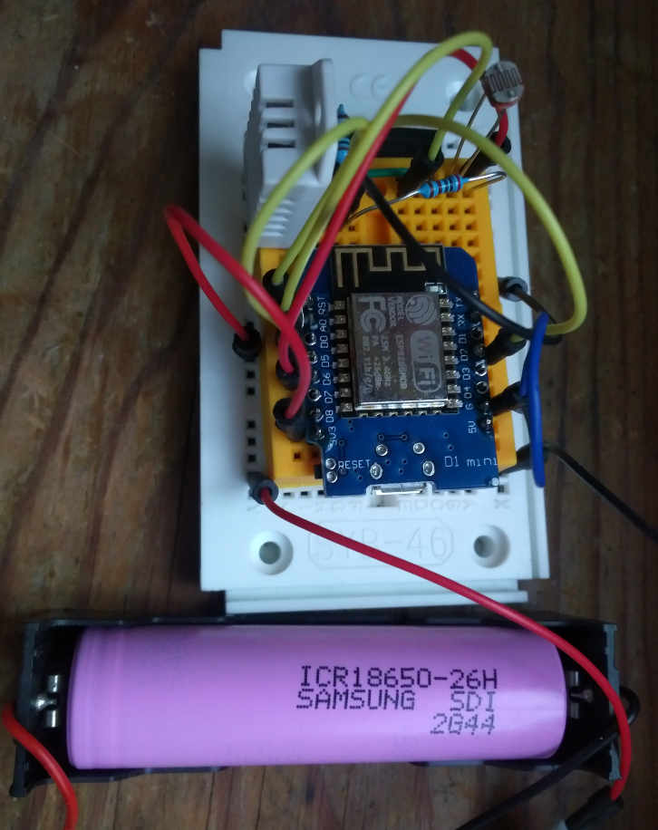

# wemos-env-iot
A small project to build an environment logger with a wemos d1 mini IoT board.

## How it looks like

## What it measures
You can view the current readings here in the countmatic reader

https://countmatic.io/online-reader?token=6e4ed640-036d-4714-b24a-ead2b8f89e27-ro

--- more to come ---
